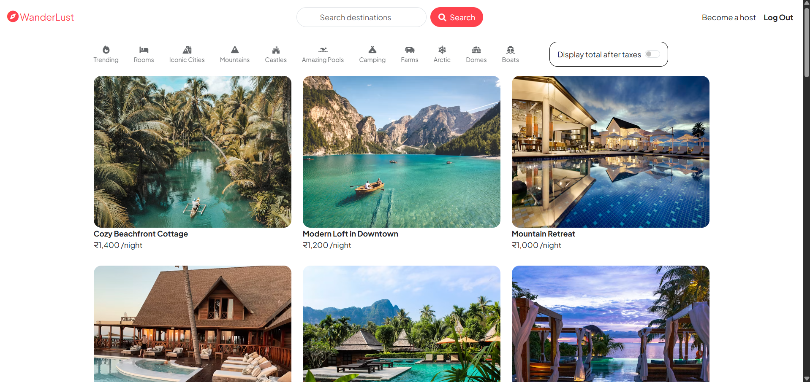
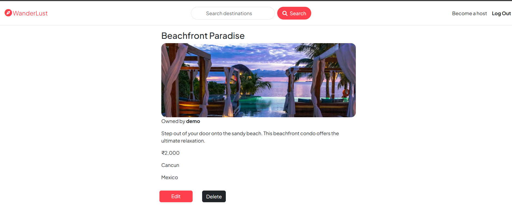
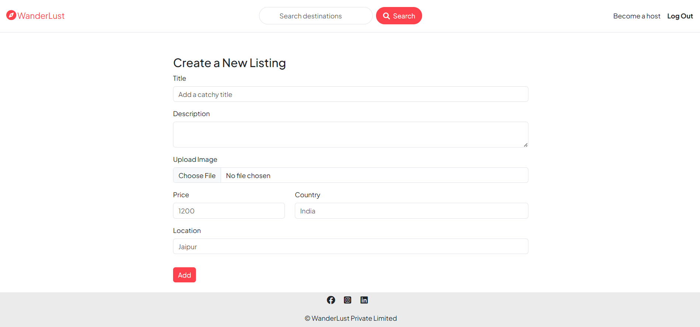

# 🌍 Wanderlust – Full Stack Travel Listing Platform

## 📌 Overview
Wanderlust is a full-stack web application for listing and managing travel stays.  
Users can create, view, update, and delete travel listings with images and details.

---

## 🎯 Purpose
This project was built to strengthen full-stack development skills including frontend design, backend development, database handling, authentication, and CRUD operations.

---

## 🚀 Features
- User authentication (Login / Signup)
- Create, edit, delete listings (CRUD)
- View all travel listings
- Image upload support
- Responsive UI design
- Secure backend routes
- Database integration (MongoDB)

---

## 🛠️ Tech Stack
- Frontend: HTML, CSS, JavaScript, EJS  
- Backend: Node.js, Express.js  
- Database: MongoDB  
- Others: REST APIs

---

## 📷 Screenshots

---

## ⚠️ Notice
This project is created for learning and portfolio purposes only.  
All rights are reserved to the author.

🚫 Do not copy, clone, or redistribute this code without permission.

---

## 🔒 License
© All Rights Reserved.  
This project is not open-source. Unauthorized use is strictly prohibited.

---

## 👩‍💻 Author
Diksha Taur
